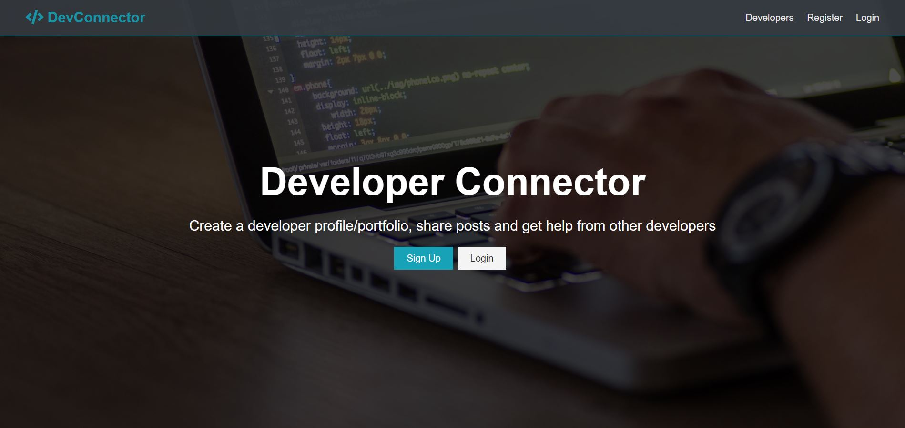
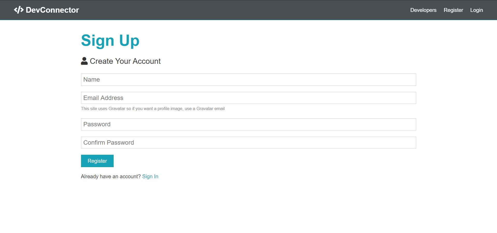
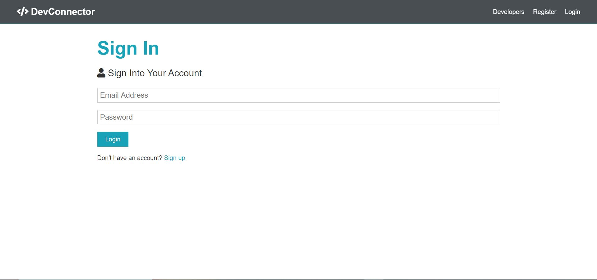
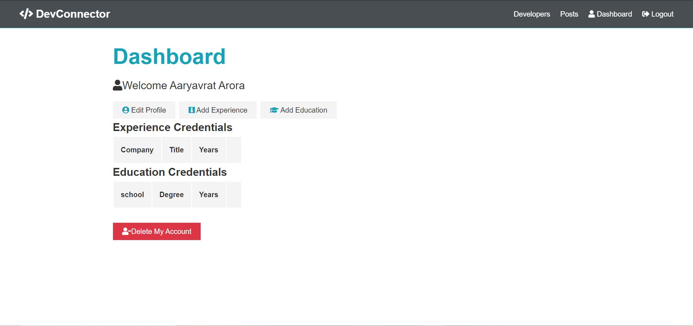
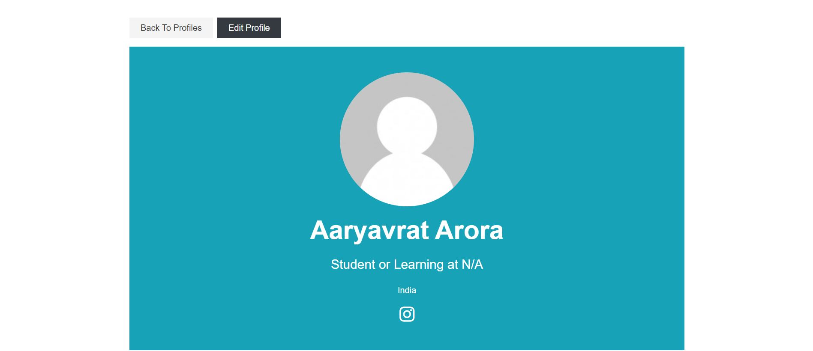
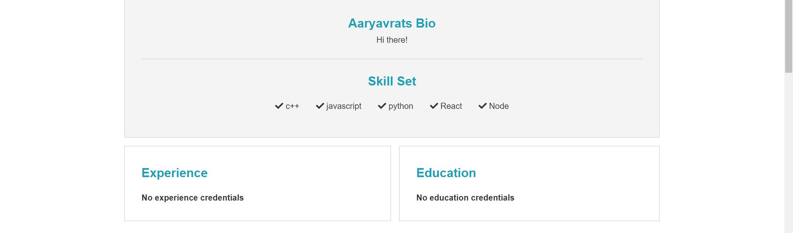

# DevConnector
A web application built on the MERN stack to connect developers.
This app is deployed using HEROKU:
[Link to the App](https://protected-ridge-28141.herokuapp.com/)

# Tech Stack
* The frontend of the application is built on react
* The backend is built on node using Express
* The database is implemented using MongoDB with MongoDB Atlas

# Setting up the Development Enviroment
### Add or Update to default.json file in config folder with the following
```
{
  "mongoURI": "<your_mongoDB_Atlas_uri_with_credentials>",
  "jwtSecret": "secret",
  "githubToken": "<yoursecrectaccesstoken>"
}
```
### Install dependancies for server and client side
>To install server side dependancies:
```
npm install
```
>To install client side dependancies:
```
cd client
npm install
```
### Running Client and Server from root
> **Note:** This is achieved using 'concurrently' dependancy
```
npm run dev
```

# Here are some images of app in action
### LANDING PAGE


### SIGN UP PAGE


### SIGN IN PAGE


### DASHBOARD


### PROFILE PAGE
##### SECTION-1

##### SECTION-2



